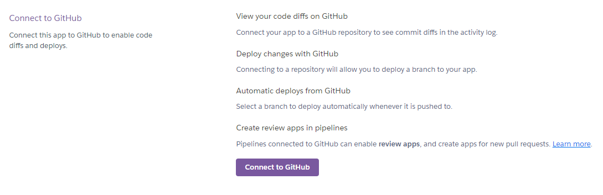

<h1 align="center">Gamer Guild</h1>

[Gamer Guild](https://gamer-guild.herokuapp.com/) has been developed for anyone interested in gaming, allowing users to connect over their geeky passion. The web app includes the following functionality:
- Create, read and update profiles
- Create, read, update and delete posts
- Like and unlike posts
- Create, read, update and delete comments on posts
- Create, read, update and delete events
- Attend and unattend events
- Create, read, update and delete poll responses on posts
- Follow and unfollow users

<h2 align="center"></h2>

## __User Experience (UX)__

### ***User Stories***

- The User Stories for this project were created with [GitHub Projects](https://docs.github.com/en/issues/planning-and-tracking-with-projects/learning-about-projects/about-projects), and can be found here: [Portfolio Project 5](https://github.com/users/AlexaH88/projects/5)

- The User Stories were organised by must haves, should haves, and could haves, and allocated to appropriate weekly sprints, covering a period of 5 weeks total.

- Included in the labels were the in-app location of the desired functionality, as well as any required back-end API functionality.  

-   #### Sprint 1 (Must Have)
    

    <!-- - Navigation:
        - As a user I can view a navbar from every page so that I can navigate easily between pages -->

-   #### Sprint 2 (Must Have)
    

    <!-- - Navigation:
        - As a user I can view a navbar from every page so that I can navigate easily between pages -->

-   #### Sprint 3 (Should Have)
    

    <!-- - Navigation:
        - As a user I can view a navbar from every page so that I can navigate easily between pages -->

-   #### Sprint 4 (Should Have)
    

    <!-- - Navigation:
        - As a user I can view a navbar from every page so that I can navigate easily between pages -->

-   #### Sprint 5 (Could Have)
    

    <!-- - Navigation:
        - As a user I can view a navbar from every page so that I can navigate easily between pages -->

### ***Design***
    
-   #### Colour Palette

    - The colour palette is made up of five colours: 
        - Dark Blue #104B87
        - Turquoise #54D9FF
        - Light Blue #C1DFFF
        - Black #000000
        - White #FFFFFF

    - The Dark Blue #104B87 was chosen for its neutral and visual appeal to most users, and as a contrast with the rest of the app. It is used for headings and icons on the components to make these stand out.

    - The Turquoise #54D9FF adds a pop of colour, and is used on icons and buttons throughout, indicating hovered or selected actions. It also creates a nice contrast to the dark blue. 
    
    - The Light Blue #C1DFFF is used on the general background of the web app, making the white components stand out, through contrast. 

    - The White #FFFFFF is uses as a neutral tone throughout and in particular for the navbar text, and background color to all components.
    
    - The Black #000000 is used as a neutral tone throughout and in particular for the text on white background, and to indicate when no clickable action is possible when hovering on the dark blue icons.
    
    - Compatibility with each other, and accessibility, were taken into account for all four colours.

-   #### Typography

    - The 'Bungee' and 'Gugi' fonts were used throughout the project. [Bungee](https://fonts.google.com/specimen/Bungee) for the navbar and headings on the pages, and [Gugi](https://fonts.google.com/specimen/Gugi) was used for the remaining text.

    - The fonts were chosen for their playful and retro feel, and the similarity to old video game text, all the while taking into account the general feel of the site. 
    
-   #### Imagery

    - All images were created by the app creator so as to allow for uniformity with the app's colour scheme and to have the content fit with the gaming theme.

        - There are two hero images throughout the site, found on the sign up and sign in pages, next to the forms. The number of hero images is deliberately kept to a minimum so as not to distract from the image-heavy content from users.

        - There are three default images on the app - applied when creating profiles, posts and events. 

        - There are two custom icons, shown when there are no search results, and when creating new content to indicate the possibility of uploading an image.

### ***Wireframes and Mock-Ups***

- Wireframes and mock-ups were created for the homepage, events, chat, and profile pages. These were adapted and improved upon throughout the development process. 

    -   Homepage Wireframe:
        

    -   Events Wireframe:
        
    
    -   Chat Wireframe:
        
    
    -   Profile Wireframe:
        

    -   Homepage Mock-Up:
        
      
    -   Events Mock-Up:
        
    
    -   Chat Mock-Up:
        
    
    -   Profile Mock-Up:
        

## __Features__

### ***Existing Features***

<!-- - #### Navigation Bar -->

  <!-- - The navigation bar includes various clickable links, allowing the user to easily access the pages on the site. Access is distinct between admin superusers and standard users, with restricted access to standard users. There is also signup, login and logout functionality which changes according to the status of the user.   
    - Sign up / login view:
    
    - Standard User Login:
    
    - Superuser Login:
    

  - The main pages on the app are:
    - Homepage
    - Search
    - Songs
    - About
    - My Songs (for standard users)
    - Admin (for admin superusers)
    - Forms (signup, login, add song, edit song, delete song)

  - In order to make navigation easier for the user, the navigation bar is in a fixed position, meaning that it remains at the top of the page as the user scrolls down.

  - The navigation bar follows the same style as the footer, and appears in the same format on all pages - this allows for consistency throughout the site.

  - A hover effect of the text being underlined in white or buttons turning white, and the cursor becoming a pointer is included, allowing the user to understand that the link is clickable.

  - The navigation bar was created with HTML and CSS  and is fully responsive across devices.
    

- #### Homepage

  

  - The homepage is the user's first port of call and consists of a captive hero image of vinyls strewn across a surface, immediately introducing the musical theme of the app. 

  - The feaature here is the search bar, allowing the user to easily search the database of songs. This page was deliberately kept minimalist so as not to overwhelm the user upon arrival. 

- #### Search Page

  

  - The Search page gives the user all the songs that match their searched keyword, whether it be in the title, artist or album name of the song. 

  - The page also has a hero image of half a vinyl that appears to drops down from the top of the screen. This hero image features on all pages other than the homepage and the song detail page.

- #### Songs Page

  

  - The Songs page allows the user to view all the songs that have been uploaded into the database, by both admin and regular users. 

  - The page consists of a table showing alphabetically sorted entried by Title, by Artist and by Album.

- #### Signup Page

  

  - The Signup page is only accessible is logged out. This page consists of a form to be completed in order to sign up and create an account.

  - The form includes warning and error messages on input, ensuring the user is always informed about required or incorrect input.

  - Once a user has signed up, they are informed via a message alert at the top of the page, which they can close at their convenience.

- #### Signin Page

  

  - The Signin page is only accessible is logged out. This page consists of a form to be completed in order to login to an existing account.

  - The form includes warning and error messages on input, ensuring the user is always informed about required or incorrect input.

  - Once a user has logged in, they are informed via a message alert at the top of the page, which they can close at their convenience. 

- #### Footer

  

  - The footer follows the same style as the navigation bar, and appears in the same format on all pages - this allows for consistency throughout the site.

  - The footer contains three elements:
    - The copyrighted site name on the left hand side. 
    - Information about the site and how it was created. 
    - Social media links, allowing the user to visit the site creator's LinkedIn and GitHub pages. Hovering over the link icons turns them purple to signal to the user that there is an interaction possible. All links are opened in separate tabs so that the user remains on the site. 

  - The footer was created with HTML and CSS only and is fully responsive across devices.

     -->

### ***Future Implementations***

<!-- - #### General -->

## __Technologies Used__

### ***Languages Used***

- [HTML5](https://en.wikipedia.org/wiki/HTML5)

- [CSS3](https://en.wikipedia.org/wiki/Cascading_Style_Sheets)

- [JavaScript](https://en.wikipedia.org/wiki/JavaScript)

### ***Frameworks, Libraries & Programs Used***

1. [React:](https://legacy.reactjs.org/docs/getting-started.html)
    - React was used to create this web app.

1. [React Bootstrap:](https://react-bootstrap.github.io/getting-started/introduction)
    - React Bootstrap was used to create this web app and to make it fully responsive. 

1. [Git:](https://git-scm.com/)
    - Git was used for version control by utilizing the Gitpod terminal to commit to Git and Push to GitHub.

1. [GitHub:](https://github.com/)
    - GitHub is used to store the projects code after being pushed from Git.

1. [GitHub Projects:](https://docs.github.com/en/issues/planning-and-tracking-with-projects/learning-about-projects/about-projects)
    - GitHub Projects was used to create the User Stories.

1. [Heroku:](https://heroku.com/)
    - Heroku was used for the deployed application.

1. [Chrome DevTools:](https://developer.chrome.com/docs/devtools/)
    - Chrome DevTools was used to consistently check the site in terms of responsivity, performance, accessibility, best practice and SEO.

1. [React Developer Tools:](https://chrome.google.com/webstore/detail/react-developer-tools/fmkadmapgofadopljbjfkapdkoienihi)
    - The React Developer Tools plugin was used on Chrome DevTools to consistently check the web app for any React errors in the console.

1. [Google Fonts:](https://fonts.google.com/)
    - Google Fonts was used to import the fonts for this web app.

1. [Font Awesome:](https://fontawesome.com/)
    - Font Awesome was used on all pages throughout the website to add icons for aesthetic and UX purposes.

1. [Font Awesome Favicon Generator:](https://gauger.io/fonticon/)
    - Font Awesome Favicon Generator was used to reproduce a favicon version of the [Font Awesome Headset Icon](https://fontawesome.com/icons/headset?f=classic&s=solid) used in the header app name.

1. [Canva:](https://www.canva.com/)
    - Canva was used to create the wireframes and mock-ups during the design process. 

## __Testing__

### ***HTML, CSS, and React JS Testing***

<!-- - [W3C Markup Validator](https://jigsaw.w3.org/css-validator/#validate_by_input) was used to validate every page of the project to ensure there were no HTML syntax errors in the project.

  - All test results:
  
  
  
  
  
  
  
  
  
  
  

-   [W3C CSS Validator](https://jigsaw.w3.org/css-validator/#validate_by_input) was used to validate every page of the project to ensure there were no CSS syntax errors in the project.
    
    

-   [JS Hint](https://jshint.com/) was used to validate the very minimal JavaScript in this project.
     -->

### ***Manual Testing***

<!-- - Manual testing was performed app-wide to ensure a smooth and positive user experience. 

- Consistent testing was carried out to ensure there was a logical flow when using the app, and that user's expectations for where links would take them, and what would follow user actions were respected.

- Alert messages are displayed when a user has completed an action, to explain why they are not seeing any data, or if input is incorrect or required:
  
  
  
  
  
  
  
  
  
  
   -->

### ***Performance, Accessibility, Best Practices, and SEO Testing***

  <!-- - [Chrome DevTools Lighthouse](https://developers.google.com/web/tools/lighthouse) was used to test Performance, Accessibility, Best Practices and SEO. All tests performed in the 90-100 green score, except for in the Performance category that came just below in the yellow range.  -->

- #### Desktop Testing with [Chrome DevTools Lighthouse](https://developers.google.com/web/tools/lighthouse)

  <!-- 
  
  
  
  
  
  
  
  
  
   -->

- #### Mobile Testing with [Chrome DevTools Lighthouse](https://developers.google.com/web/tools/lighthouse)
    
  <!-- 
  
  
  
  
  
  
  
  
  
   -->

- #### Further Accessibility Testing

    - [EightShapes Contrast Grid](http://eightshapes.com/) was used to test the colour palette of the site for any accessibility issues. Only AAA and AA rating options were used on the site. 
    
    
    - Any icons on the site that are for decorative purposes only use the aria-hidden="true" attribute to accommodate for accessibility, as recommended by [Font Awesome's Accessiblity Page](https://fontawesome.com/v5/docs/web/other-topics/accessibility)

### ***Responsive Testing***

- [React Bootstrap:](https://react-bootstrap.github.io/getting-started/introduction) was used to ensure the app is responsive throughout. 

- [Chrome DevTools](https://developer.chrome.com/docs/devtools/) was used to regularly check for any responsive design issues. 

### ***Further Testing***

- The web app was tested on Google Chrome, Firefox, and Microsoft Edge browsers.

- The web app was viewed on a variety of devices such as Desktop up to 28 inch screen with 4k resolution, Laptop, Pixel 3a, Pixel 4, Samsung Galaxy Tab S5e, iPhone 11.

- A large amount of testing was done to ensure that all pages were linking correctly.

- Friends and family members were asked to review the web app and documentation to point out any bugs and/or user experience issues.

### ***Fixed Bugs***

<!-- - Initially liking, and commenting on both posts and events created issues. Likes and comments were unable to be created at all if no events existed, and once they did the likes and comments were applied to the event, as well as the post in question. The back-end API was not set up correctly to allow for interaction with either one or the other, and required one of each to be selected. + HOW DID I FIX... -->

<!-- -   #### Count Bug

	- The likes, comments, attending counts on the post and event detail view were showing up incorrectly. A newly created post or event would show several likes, comments and attendees despite the fact that the back-end database correctly showed 0, as did the PostsPages and EventsPages.
		- Detail View:
		
    	- Database:
    	

	- This issue was fixed on the back-end by revising the EventDetail and PostDetail views to be specific to events and posts resepectively and not all the user's likes, comments etc.
		- Original Code:
    	
    	- Fixed Code:
    	 -->

### ***Known Bugs***

<!-- - Not a bug per se but something that decreases UX on the app is the mobile version of large data list of the songs. This is mentioned in future implementations and is to be improved upon.  -->

[//]: <> (Deployment section taken from Dave Horrocks, and credited in the Content section of the Credits)

## __Deployment__

### ***Heroku***

1. Navigate to your [Heroku dashboard](https://dashboard.heroku.com/apps)
2. Click "New" and select "Create new app".  
  
3. Input a meaningful name for your app and choose the region best suited to
  your location.  
  
4. Select "Settings" from the tabs.  
  
5. Click "Reveal Config Vars".  
 
6. Input all key-value pairs as necessary from the `.env` file. **Ensure DEBUG
   and DEVELOPMENT are not included**.
   
7. Click "Add buildpack".  
 
8. Add "python" from the list or search if necessary, remember to
 click save.  
 
9. Select "Deploy" from the tabs.  

10. Select "GitHub - Connect to GitHub" from deployment methods.  
 
11. Click "Connect to GitHub" in the created section.  
 
12. Search for the GitHub repository by name.  
13. Click to connect to the relevant repo.
14. Either click `Enable Automatic Deploys` for automatic deploys or `Deploy
 Branch` to deploy manually. Manually deployed branches will need
 re-deploying each time the repo is updated.  
 
15. Click `View` to view the deployed site.  
    
16. The live site can also be accessed from your repo in GitHub from the
    environments section of the repo.

The site is now live and operational

## __Credits__

### ***Code***

- The following were used as references to help with writing the HTML, CSS, JavaScript and Python code:
  - [Code Institute LMS](https://learn.codeinstitute.net/ci_program/diplomainsoftwaredevelopmentadvancedfrontend), in particular the [Moments Walkthrough](https://learn.codeinstitute.net/courses/course-v1:CodeInstitute+RA101+2021_T3/courseware/70a8c55db0504bbdb5bcc3bfcf580080/953cd4e5015f483bb05263db3e740e19/)
  - [W3Schools](https://www.w3schools.com/) 
  - [Stack Overflow](https://stackoverflow.com/)
  - [MDN Web Docs](https://developer.mozilla.org/en-US/)
  - [React Documentation](https://legacy.reactjs.org/docs/getting-started.html)
  - [React Bootstrap Documentation](https://react-bootstrap.github.io/getting-started/introduction)

  - The handling internal links on `addPostButton` and `addEventButton` functionality was taken from [Where Is The Mouse](https://whereisthemouse.com/how-to-use-button-as-link-in-react) and adapted to suit the needs of this project.

  - The `YouTubeEmbed` component was created with a combination of these two tutorials by [DEV](https://dev.to/bravemaster619/simplest-way-to-embed-a-youtube-video-in-your-react-app-3bk2) and [A Designer Who Codes](https://www.youtube.com/watch?v=xNRJwmlRBNU) and adapted to suit the needs of this project.

### ***Content***

- All text content was written by the site creator [Alexa Hendry](https://github.com/AlexaH88). 

- The Deployment section in the README was taken from the masterful [Dave Horrocks](https://github.com/DaveyJH), who put it so much better than I could! 

### ***Media***

- The hero images, default images, upload and no results images were created by the app creator [Alexa Hendry](https://github.com/AlexaH88) using [Canva:](https://www.canva.com/).

- Credits to [Font Awesome](https://fontawesome.com/) for the ghost icon and the events icon on the default images.

- Credits to [Trendify](https://www.canva.com/p/trendify/) for the retro upload and alien used on the Upload and No Results images.

    - Hero Images:
        - Sign Up Hero: 
        - Sign In Hero: 
    
    - Default Images:
        - Default Profile: \
            
        - Default Event: \
            
    
    - Upload Image:
        - Upload: \
            
    
    - No Results Images:
        - No Results (white background): \
            
        - No Results Pages (pale blue background): \
            

### ***Acknowledgements***

Massive thanks to: 

- My mentor, [Lauren-Nicole Popich](https://github.com/CluelessBiker), for guiding me and giving me helpful feedback and advice - and for giving me confidence when I didn't believe in myself!

- My fellow Code Institute students and friends for their help, generous feedback, and incredible knowledge:
  
  - [Abi Harrison](https://github.com/Abibubble)
  - [Dave Horrocks](https://github.com/DaveyJH)
  - [Emanuel Silva](https://github.com/manni8436)
  - [Kera Cudmore](https://github.com/kera-cudmore)
  - [Megan Vella](https://github.com/Medusas71)
  - [Monika Hrda](https://github.com/monika-hrda)
  - [Natalie Alexander](https://github.com/natalie-kate)
  - [Sandra Atino](https://github.com/Atinos31)
  - [Suzy Bennett](https://github.com/suzybee1987)

- Tutor Support, Student Care and the Slack Community at [Code Institute](https://codeinstitute.net/global/) for their support.

- And last but not least, my fiancé [Antoine Masson](https://www.linkedin.com/in/antoine-masson-55b65094/) for helping me through the stressful moments and for supporting us financially while I make this big career change. 